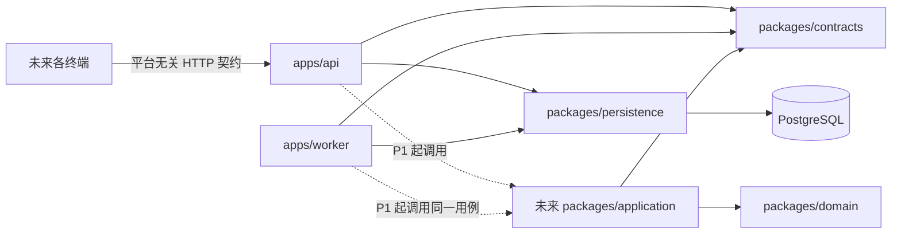

# 模块边界与依赖

## 运行时拓扑

P0 没有创建空的 application、provider、storage 或 ORM 层。它们在真正出现用例时再
建立，以避免“目录齐全”被误解为能力已完成。

## 依赖规则

| 模块                   | 可以依赖                                  | 禁止依赖                                        |
| ---------------------- | ----------------------------------------- | ----------------------------------------------- |
| `packages/domain`      | 标准库、显式传入的时间/ID/策略            | HTTP、浏览器、数据库、ORM、网络、移动 SDK       |
| `packages/contracts`   | 无运行时业务依赖                          | ORM 实体、端特有 UI 模型                        |
| `packages/persistence` | contracts、PostgreSQL driver              | Fastify 路由、界面、Provider                    |
| `apps/api`             | contracts、persistence；P1 起 application | 直接实现领域规则、绕过用例写库                  |
| `apps/worker`          | contracts、persistence；P1 起 application | 绕过授权/版本/事务，使用内存 timer 保存关键任务 |

未来的 `application` 负责用例编排、逐请求授权和事务边界；Provider 与
ObjectStorage 都是端口/适配器，不能直接修改 Trip。API 与 Worker 是独立进程，
但调用同一套用例。

## P0 可运行边界

- API liveness 仅说明进程可应答。
- API readiness 必须执行 PostgreSQL `SELECT 1`；缺配置或连接失败返回 503。
- Worker 周期性执行相同数据库探针，写入带时间戳的健康文件，并响应
  `SIGINT` / `SIGTERM` 优雅停止。
- P0 不开放任何无鉴权的旅行业务接口。
