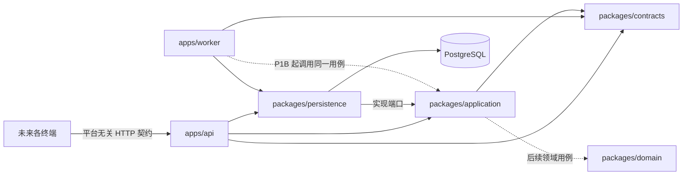

# 模块边界与依赖

## 运行时拓扑

P1A 因身份用例首次建立 application 和 Prisma ORM；provider、storage 与业务 Job 仍按
阶段后置，避免“目录齐全”被误解为能力已完成。

## 依赖规则

| 模块                   | 可以依赖                                        | 禁止依赖                                        |
| ---------------------- | ----------------------------------------------- | ----------------------------------------------- |
| `packages/domain`      | 标准库、显式传入的时间/ID/策略                  | HTTP、浏览器、数据库、ORM、网络、移动 SDK       |
| `packages/contracts`   | 无运行时业务依赖                                | ORM 实体、端特有 UI 模型                        |
| `packages/application` | contracts、标准库、端口接口                     | Fastify、Cookie、Prisma、具体邮件供应商         |
| `packages/persistence` | contracts、application 端口、PostgreSQL、Prisma | Fastify 路由、界面、Provider                    |
| `apps/api`             | contracts、application、persistence             | 直接实现领域规则、绕过用例写库                  |
| `apps/worker`          | contracts、persistence；P1B 起 application      | 绕过授权/版本/事务，使用内存 timer 保存关键任务 |

`application` 负责身份用例编排、逐请求授权与端口；持久层负责数据库事务。Provider 与
ObjectStorage 都是端口/适配器，不能直接修改 Trip。API 与 Worker 是独立进程，
但调用同一套用例。

## P0 健康边界（持续回归）

- API liveness 仅说明进程可应答。
- API readiness 必须执行 PostgreSQL `SELECT 1`；缺配置或连接失败返回 503。
- Worker 周期性执行相同数据库探针，写入带时间戳的健康文件，并响应
  `SIGINT` / `SIGTERM` 优雅停止。
- P0 不开放任何无鉴权的旅行业务接口。

## P1A 身份边界

- API 只从已验证 Session 推导 actor，不接受客户端 ownerId。
- bearer credential 是可替换 transport adapter，不进入 application/domain 契约。
- Prisma 只存在于 persistence；Magic Link 单次消费、禁用撤销和 Session 建立由数据库
  事务保护。
- 管理员仅能执行账号管理动作，不能借角色读取未来私人业务资源。
