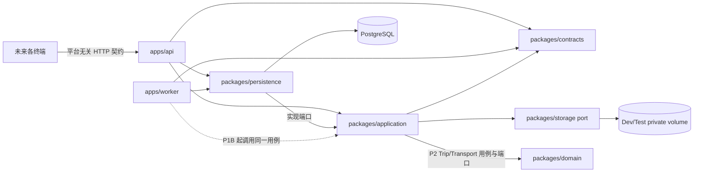

# 模块边界与依赖

## 运行时拓扑

P1A 建立身份 application 和 Prisma ORM，P1B1 增加持久 Job，P1B2 增加通知与可替换的
对象存储 port。P2A 增加 Trip application 用例与 PostgreSQL repository；P2B 在同一事务边界
增加当前相邻 Transport、历史与 resolved 时间端口。Day 与 connection 都在契约层投影，不建
假 Transport 或第二套日期事实。Dev/Test 本地适配器不代表 Staging/Production provider 已选择。

## 依赖规则

| 模块                   | 可以依赖                                        | 禁止依赖                                        |
| ---------------------- | ----------------------------------------------- | ----------------------------------------------- |
| `packages/domain`      | 标准库、显式传入的时间/ID/策略                  | HTTP、浏览器、数据库、ORM、网络、移动 SDK       |
| `packages/contracts`   | 无运行时业务依赖                                | ORM 实体、端特有 UI 模型                        |
| `packages/application` | contracts、storage port、标准库、端口接口       | Fastify、Cookie、Prisma、具体邮件/存储供应商    |
| `packages/persistence` | contracts、application 端口、PostgreSQL、Prisma | Fastify 路由、界面、Provider                    |
| `packages/storage`     | Node 基础设施 API、平台无关存储契约             | Domain、Fastify、Prisma、Trip 业务规则          |
| `apps/api`             | contracts、application、persistence             | 直接实现领域规则、绕过用例写库                  |
| `apps/worker`          | contracts、persistence；P1B 起 application      | 绕过授权/版本/事务，使用内存 timer 保存关键任务 |

`application` 负责用例编排、逐请求授权与端口；持久层负责数据库事务。Provider 与
ObjectStorage 都是端口/适配器，不能直接修改未来 Trip。API 与 Worker 是独立进程，
但调用同一套用例。

## P0 健康边界（持续回归）

- API liveness 仅说明进程可应答。
- API readiness 必须执行 PostgreSQL `SELECT 1`；缺配置或连接失败返回 503。
- Worker 周期性执行相同数据库探针，写入带时间戳的健康文件，并响应
  `SIGINT` / `SIGTERM` 优雅停止。
- P0 不开放任何无鉴权的旅行业务接口。

## P1A 身份边界

- API 只从已验证 Session 推导 actor，不接受客户端 ownerId。
- bearer credential 是可替换 transport adapter，不进入 application/domain 契约。
- Prisma 只存在于 persistence；Magic Link 单次消费、禁用撤销和 Session 建立由数据库
  事务保护。
- 管理员仅能执行账号管理动作，不能借角色读取未来私人业务资源。

## P1B2 私有基础设施边界

- Notification HTTP 只暴露当前用户列表与 dismiss；创建入口保留在可信 application / worker。
- Local Filesystem adapter 仅用于 Development/Test，并使用 Compose 独立命名卷；文件不放在
  public web root，不暴露实际路径或永久公开 URL。
- 正式 Attachment upload/download、Trip 关联、文件解析与真实云对象存储均后置。

## P2A Trip Core 边界

- API 只接收类型化 Trip command，owner 由已验证 Session actor 提供。
- Application 校验自然日、命令与权限并投影 Day；Persistence 在单一事务中负责 Trip 行锁、
  owner advisory lock、版本校验、节点写入、有效范围与 DateOwnership reconciliation。
- DateOwnership 是唯一日期事实；中间空白日保留 ownership，首尾空白编辑态不写数据库。
- P2A 不引入 Transport、Provider、时间传播、生命周期自动推进或跨日移动。

## P2B Transport / Temporal 边界

- current Transport 只能连接整个 timeline 当前相邻的两个 PLACE_VISIT；MISSING 与 FreeAction
  状态由 projection 表达。
- 结构写入、精确邻接失效、历史快照、日期 reconciliation 与 version+1 共享同一事务。
- resolved TemporalValue 强关联 Node 或 Transport，并按 PLANNED/ESTIMATED/ACTUAL 分层；
  authoritative value 仅为 absolute instant + IANA timezone。
- P2B 不实现 Provider、传播/反推、UserTimeIntent、风险、生命周期或任意时间 HTTP 写接口。
