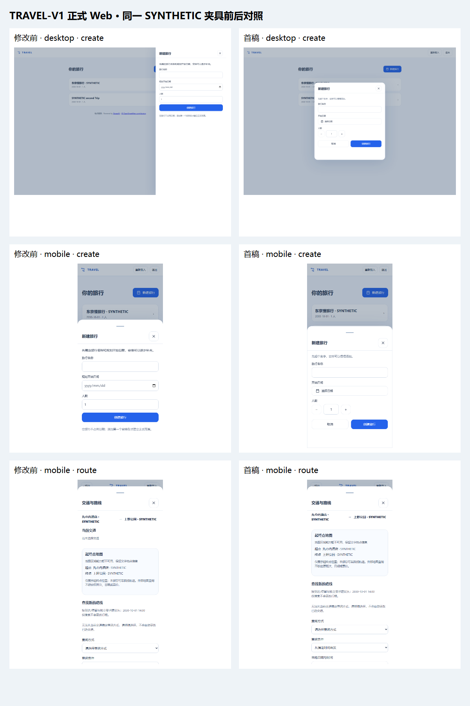

# P7A 正式 Web 交互统一首稿

推荐模型：沿用客户端可用 Sol；推理强度 High。备选为客户端实际可用的 Sol；异步关闭、认证恢复或日期语义出现难解问题时提高推理强度。提示词没有切换模型。

## 本地代码和运行实例

- 批准基线：`4f6b31a262acdf9ac634f0ad58eab437ca79d4cb`；Tree：`41c4e39bf679cbcf75d1fc46f57addec94b64790`。
- 分支：`feat/p7a-web-ux-round1`；工作树：`D:/TRAVEL-V1/worktrees/p7a-local`。没有修改 main 或另一个含未知修改的工作树。
- 正式 Web：<http://127.0.0.1:5174/>，Vite 的实际进程脚本位于上述工作树的 `apps/web/node_modules/vite/bin/vite.js`。内置浏览器已刷新并实际看到新的字段内“请输入邮箱”验证，没有原生气泡。
- 现有 API 3000、Worker、PostgreSQL 17 / 54327、体验数据库 `travel_p7a_local_test` 保留；登录方式、邮件捕获和原有 Start/Stop/Login/Status 文件未覆盖。
- 邮件仍为 capture 模式，会进入本地捕获文件，不会投递到真实邮箱。没有启用真实 Provider、生产 Gate 或公网。
- 真实端到端验收另用 `travel_p7a_ux_round1_test`、API 43160、Web 5175、独立 Worker/mail/objects。回归集成用 `travel_p7a_ux_integration_test`；测试实例完成后停止，数据库保留，没有 reset 或清理未知内容。

## 首稿实现

共享字段验证保留 required/min/step/maxlength、FormData、dirty 和服务端验证，统一字段错误、首错焦点、局部反馈。提交空白、非法数字或程序化绕过时不会发业务写入。登录失败保留邮箱并维持防枚举；其他认证恢复继续核对原账户。

新建旅行在桌面居中，手机使用底部 sheet；日期使用七列日历，支持年月快速选择、键盘和取消，空值不自动填今天，过去日期仍可选择。人数使用可直接输入的步进控件。当地日期与时间保留自然日和 IANA 时区转换，时间直接输入 HH:mm。

共享关闭确认改为应用内异步 dialog，拒绝、Escape、拖动、失去 pointer capture、等待中的请求和提交快照保护仍在。Safari 的指针点击焦点与 Chromium 不同，因此显式保留打开控件来恢复焦点。地图先在点击时预留窗口；确认接受后以无 referrer、无 opener 的链接导航，拒绝关闭窗口，拦截时保留草稿。重复点击只处理一次。

添加安排在同一容器中切换地点/自由行动。地点搜索与已保存地点分开，选择后只留一份摘要和“更换”；语言默认值及 selectionToken、来源、迟到响应保护不变。时间、停留和备注分组保存，不承诺原子“保存全部”。

路线按当前交通→查询→候选→预览分阶段，在同一容器返回且保留条件。重要阻断和必要同意始终可见，普通说明和完整交通详情可展开。Query/Preview 不改行程，采用和撤销的权限、TTL、版本、事务及幂等不变。资料以在线/私人静态备份区分，版本和坐标放入详情，明确生成时间与不会自动更新。

## 依赖：三个旅行卡片动作

完整 API、application/persistence、命令契约及测试均未发现整趟改名、整趟删除或公开分享的可靠接口。没有新增后端或用本地过滤、localStorage、直接删库冒充完成。

常规卡片已改为 article + 独立进入按钮，没有嵌套按钮。三个动作只在 <http://127.0.0.1:5174/test/ux-review/> 的独立、明确标注 SYNTHETIC 夹具中评审：桌面 hover/focus 铅笔及分享/删除圆按钮；手机菜单顺序为改名、分享、删除；Enter/IME/Escape 和一次危险确认已测。**这些动作没有接入真实旅行。**

最小后端依赖详见 [交互清单](interaction-inventory.md)：owner、baseTripVersion、幂等键、服务器返回、失败保留；删除需先明确关联数据范围和恢复条件；分享需独立内容白名单、访问和停止语义，不能使用包含私人备注的备份替代。

## 页面与状态验收矩阵

| 页面 / 状态                           | 首稿入口与结果                                 | 桌面 / 窄屏证据                                                                                      |
| ------------------------------------- | ---------------------------------------------- | ---------------------------------------------------------------------------------------------------- |
| 登录 / 恢复 / 会话失效                | 邮箱字段内错误、发送中、失败保留；原账户恢复   | 实际内置浏览器；experience 的 auth、401、owner-switch、draft recovery 测试                           |
| 旅行列表 / 空态 / 读取失败            | 进入卡片、新建；失败显示重新载入，不补假列表   | authoring、experience；before/after create 背景为同一 SYNTHETIC 列表                                 |
| 新建 / 日期 / 人数                    | 居中 modal 或 sheet，取消、步进、统一日历      | ux-round1：320、375、390、430、1440；24px 根字号、横屏；create/calendar/validation/confirmation 截图 |
| 全部日程 / 今天 / 航班                | 保留日期、时间层、下一步和重要冲突             | experience、in-trip、travel-web-acceptance；before/after itinerary                                   |
| 添加地点 / 自由行动 / 移动            | 同容器切换、共享字段验证、目标日期和位置重核对 | authoring、place-search、place-search-draft；慢请求、未知结果及版本恢复                              |
| 搜索 / 选中 / 更换 / 取消             | 明确搜索或保存地点，选择不写入、添加才写入     | place-search、place-search-draft；IME 输入不搜索、过期 token 后可重新选择                            |
| 地点时间 / 停留 / 备注                | 独立分组保存反馈、快照、失败保留               | experience 的 R1/R2；真实 PG 时间值；before/after place                                              |
| 当前交通 / 查询 / 候选 / 预览         | 单容器分阶段、返回保留条件                     | ux-round1、preview-presentation、travel-web-acceptance；real-api route-preview                       |
| 采用 / 撤销 / 过期 / 冲突             | 显式采用，必要同意不预选；过期拒绝；撤销保护   | 真实 API/Worker/PG E2E；replanning-hardening、alternatives、integration                              |
| 影响 / 调整方案                       | 权威状态与主动 Query，不自动采用               | impact、alternatives；等待、版本、起点、会话及关闭保护                                               |
| 地图 / SDK 失败 / 位置缺失 / 外部入口 | 局部降级，不补轨迹；异步确认、弹窗拦截保留草稿 | mini-map、regional-map；ux-round1 的 cancel/accept/blocked，外网请求全部拦截为 SYNTHETIC             |
| 在线资料 / 私人静态备份               | 在线与静态分开；生成时间、不更新、技术详情     | static-backup；离线、资料读取部分失败、损坏、owner/版本变化、下载零网络；before/after materials      |

浏览器仿真及键盘视口测试不能证明真实手机软键盘或真实设备 Safari 已验收；此次没有进行手机实机访问。

## 截图和可复现证据



- `before/`：从锁定 SHA 的 git archive 单独运行 Web 5176，使用当前契约相同的 SYNTHETIC fixture；不切换体验工作树。截图后已停止该临时进程。
- `after/`：实际 UI 分支的正式 Web 5174；截图使用相同 fixture，不包含体验数据库中的用户旅行。
- `real-api/verification.json`：独立测试库中的真实 Worker 捕获邮件登录、新建、添加两地点、时间编辑、Query→Preview→Adopt→Undo、刷新和窄屏，另有对应截图。
- `scripts/p7a-ux-capture.mjs` 可复现前后截图（须先以 5176 提供基线 Web）；`node --import tsx scripts/p7a-ux-capture.mjs`。

## 测试记录

| 检查                              | 实际结果                                                                                                                                                                          |
| --------------------------------- | --------------------------------------------------------------------------------------------------------------------------------------------------------------------------------- |
| lint / typecheck / build / format | 本机全部通过；最终 SHA 的 CI 再执行                                                                                                                                               |
| 单元测试                          | Windows 本机 1280 通过、2 项环境限制：openssl 不在 PATH；创建符号链接返回 EPERM。没有 skip、删用例或弱化断言；Linux CI 需核对全量结果                                             |
| PostgreSQL 集成                   | persistence 25 文件 / 106 测试通过；API 21 文件 / 713 测试通过，共 819                                                                                                            |
| Chromium / WebKit                 | 全量 728 项：727 通过，1 项认证等待断言竞态；修正为等待新账户验证完成后，备份全量专项两浏览器通过。新增可见地点/时区焦点等 UX 专项再次通过，保留全部业务断言。最终 CI 覆盖 732 项 |
| 外部地图专项                      | Chromium / WebKit 共 6 项通过；真实外网请求被拦截，无付费调用                                                                                                                     |
| 真实 API + Worker + PG            | PASS，读取版本不变；采用、撤销各 +1；实际节点和 transport 持久化验证；浏览器及 API 错误 0                                                                                         |
| GitHub                            | Draft PR，最终 SHA 对应完整 CI 才算远端检查通过；不以历史基线 CI 替代                                                                                                             |

## 停止、重启与回退

原 `Start.ps1` 故意锁死基线 SHA，在 UI 提交后会拒绝启动，不能把该保护删掉。本轮新增独立启动器，复用原 env、数据库和服务路径，不初始化或迁移数据库：

```powershell
& 'D:/TRAVEL-V1/worktrees/p7a-local/scripts/p7a-start-local-ux.ps1'
```

它检查批准的 UI 分支与基线祖先关系，核对本地体验库、SYNTHETIC/capture；只复用或启动匹配本工作树路径的进程，Web 固定 5174 且不自动换端口。已实际执行健康核对成功。

停止继续使用 `D:/TRAVEL-V1/local-server/p7a/Stop.cmd`；邮箱登录仍用原 `Login.cmd`，健康查看仍用原 `Status.cmd`。这些文件及私有 env 均未修改。数据库、邮件与日志保留。

回到批准基线时先停止服务、确认 UI 工作树干净，再 checkout 锁定 SHA，使用原 `Start.cmd`；不要 reset/clean 未知修改。UI 首稿可恢复到 feature branch 后用新启动器。

当前仅绑定本机。手机局域网访问需要另行授权地址绑定、防火墙及 Magic Link 回跳配置；本轮没有开放公网、部署生产或声称完成实机验证。
